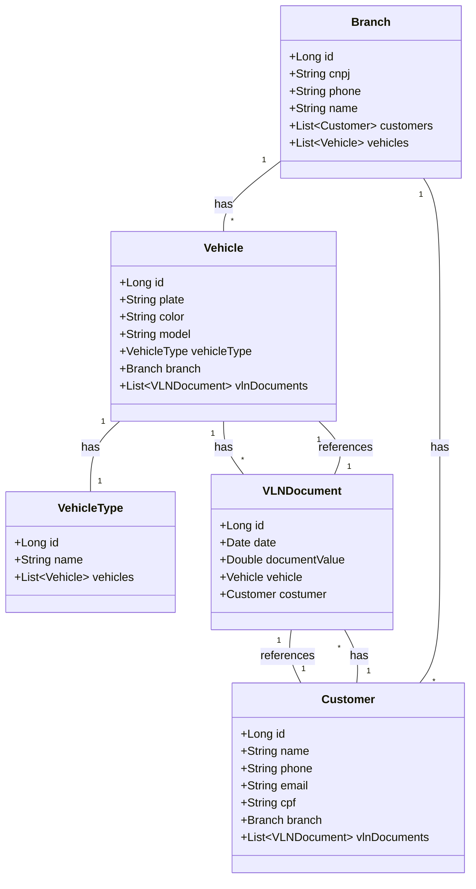

# 🚗 Vehicle Allocation System  

A **Spring Boot** application designed for managing vehicle allocation across multiple branches. This system helps track branches, customers, vehicles, and rental transactions efficiently.  

## 📌 Features  
- **Branch Management:** Register and manage multiple branches with contact information.  
- **Customer Records:** Store customer details, linking each customer to a specific branch.  
- **Vehicle Management:** Register vehicles with attributes such as plate, color, and model.  
- **Vehicle Types:** Classify vehicles into categories (e.g., Sedan, SUV, Truck).  
- **VLN Document Tracking:** Manage rental transactions with rental date and value.  

## 🛠️ Tech Stack  
- **Spring Boot** – Backend framework  
- **Spring Data JPA** – ORM for database management  
- **Spring WebFlux** – Reactive programming for non-blocking API communication  
- **H2 Database** – In-memory database for local development  
- **PostgreSQL** – Relational database for production  
- **Jackson Databind** – JSON serialization/deserialization  
- **JUnit & Reactor Test** – Automated testing  

## 📂 Class Diagram  


## 🚀 Getting Started
**Prerequisites**
Java 17+
Maven
PostgreSQL

**Installation**

```bash
git clone https://github.com/seu-usuario/vehicle-allocation-system.git
cd vehicle-allocation-system
mvn clean install
```
**Run the application**
```bash
mvn spring-boot:run
```

**API test with CURL**
```bash
curl -X POST http://localhost:8080/customers \
     -H "Content-Type: application/json" \
     -d '{"name": "John Doe", "email": "johndoe@example.com", "phone": "123456789", "cpf": "000.000.000-00"}'
```

